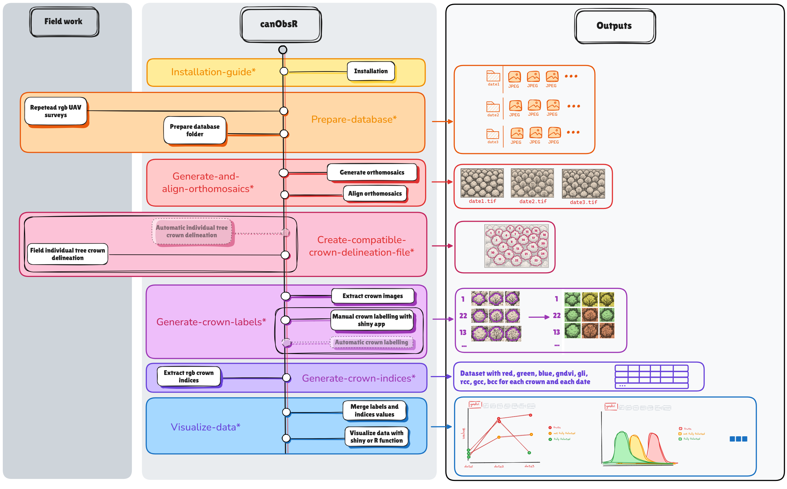

<!-- README.md is generated from README.Rmd. Please edit that file -->

# canObsR

# Overview

canObsR is a R package which aims at streamlining, standardizing and
facilitating processing of repetead UAV surveys. It notably allows
generating 3D and 4D mosaics & mosaics spatial alignment using
state-of-the-art approaches. canObsR is also used to do phenological
monitoring at the individual tree level. It gives tools to build a
database with pictures of individual crown overtime, spectral indices of
crowns overtime, add labels to classify pictures and analyse the
phenological and the spectral data.

# Installation

The installation of canObsR involves several steps that go beyond a
typical R package to ensure seamless integration between R, Python and
Metashape. To avoid dependency conflicts and enabling the package’s full
functionality you must follow [the installation
guide](https://umr-amap.github.io/canObsR/articles/Installation-guide.html).

Installations steps :  
- Install R, Rstudio, Rtools  
- Install reticulate package in R  
- Install canObsR package in R  
- Install miniconda or Anaconda  
- Create conda environment from “canobsR/PYTHON/environment.yaml”  
- Install Metashape python API  
- Activate Metashape in your conda environment

# Workflow

canObsR workflow is represented by the Fig.1. The documentation
associated to each part of the workflow is mentioned by an \* in the
figure and the differents links are available just below in the
“Documentation” section. The functionalities shows by transparent
background rectangles are still being developed.

Fig.1 : canObsR workflow

# Documentation

All the R package documentation is available
[here](https://umr-amap.github.io/canObsR/).

The following articles are available :  
- [Prepare
database](https://umr-amap.github.io/canObsR/articles/Prepare-database.html)  
- [Generate and align
ortomosaics](https://umr-amap.github.io/canObsR/articles/Generate-and-align-orthomosaics.html)  
- [Create compatible crown delineation
file](https://umr-amap.github.io/canObsR/articles/Create-compatible-crown-delineation-file.html)  
- [Generate crown
labels](https://umr-amap.github.io/canObsR/articles/Generate-crown-labels.html)  
- [Generate crown
indices](https://umr-amap.github.io/canObsR/articles/Generate-crown-indices.html)  
- [Visualize
data](https://umr-amap.github.io/canObsR/articles/Visualize-data.html)

And the [Reference
section](https://umr-amap.github.io/canObsR/reference/index.html) stores
all the documentation about the functions.

# Citation

To cite ‘canObsR’, please use citation(‘canObsR’).
