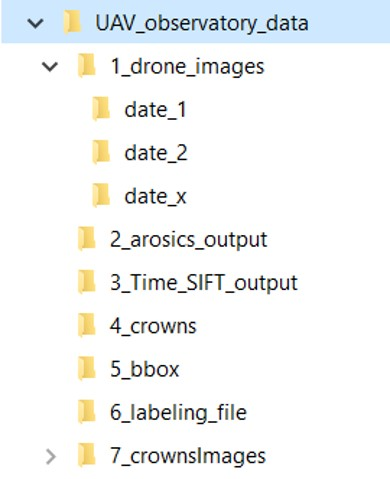
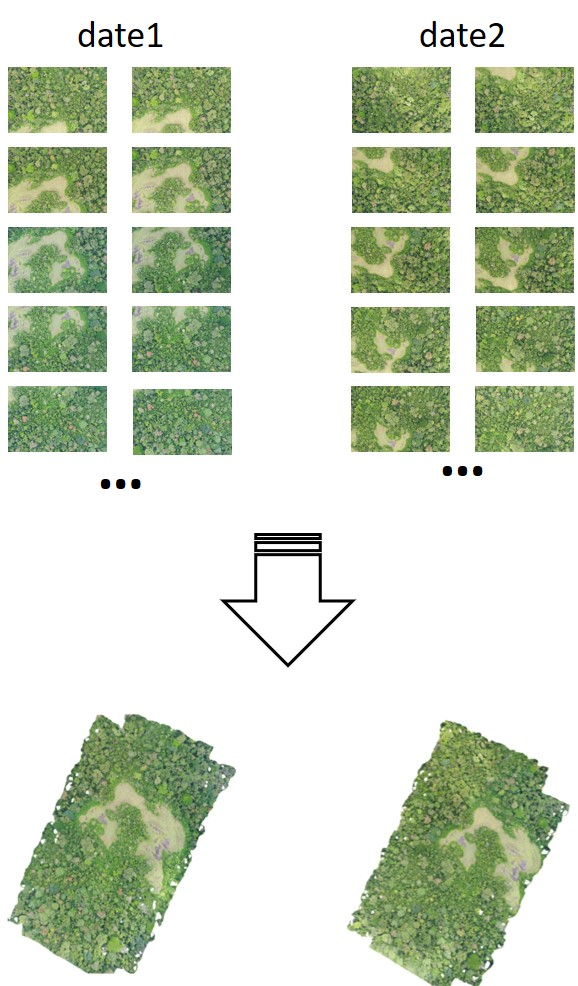
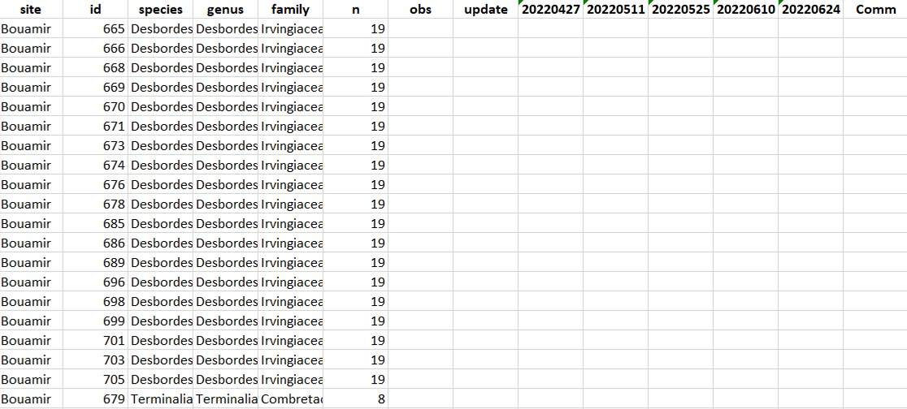

<!-- README.md is generated from README.Rmd. Please edit that file -->

# managecrownsdata

- [The package](#the-package)
- [Citation](#citation)
- [Install](#install)
- [Documentation](#documentation)
- [How to use managecrownsdata](#how-to-use-managecrownsdata)
- [General advices](#general-advices)
- [Generate orthomosaics](#generate-orthomosaics)
- [Extract crowns images](#extract-crowns-images)
- [Create labeling file](#create-labeling-file)

<!-- badges: start -->
<!-- badges: end -->

# The package

This R package aims at streamlining, standardizing and facilitating
processing of repetead UAV surveys from R. It focuses (for now) on RGB
data. It notably allows generating 3D and 4D mosaics & mosaics spatial
alignment using state-of-the-art approaches, provides tools to generate
reference labels, segment crowns (not now) and classify crown
phenophases (not now).

# Citation

To cite ‘managecrownsdata’, please use citation(‘managecrownsdata’).

# Installation

``` r
library(devtools)
install_github("https://github.com/hugolblc/managecrownsdata.git")
```

# Documentation

In addition to the usual R package documentation, we also have extensive
docs and examples at: <https://hugolblc.github.io/managecrownsdata/>

# How to use managecrownsdata

## Python environment

First, make sure you have python\>3.9 and anaconda / miniconda installed
on your device. If not, you can download them using the following links
:

<https://www.python.org/downloads/> <https://www.anaconda.com/download/>

After completing the installation steps, you can create your own python
environment that will contain everything you need to call this package’s
functions.

``` r
# Imports
library(reticulate)
library(managecrownsdata)
```

``` r
# Python env creation
env_name <- "managecrownsdata_env"   # use the name you want for your environment
environment = file.path( system.file(package="managecrownsdata"), 'PYTHON/environment.yaml')   # use the environment.yaml file included in the package

conda_create(env_name, environment = environment)
use_condaenv(env_name)
```

## Metashape

The environment you just created contains already all necessary
dependences but the Metashape python API, which is required to align
photos using TimeSIFT. To install it, you first need to download a file
from the Metashape website :
<https://www.agisoft.com/downloads/installer/>. Go to the “Python 3
module” section and click on the link corresponding to your operating
system. This should download a file named “Metashape\[…\].whl”. Then,
copy the path to the downloaded .whl file below

``` r
# Add metashape API to env
path_to_whl_file <- "MYPATH/Metashape-2.1.3-cp37.cp38.cp39.cp310.cp311-none-win_amd64.whl"   #replace with your path

py_install(path_to_whl_file, envname = env_name, pip=TRUE)
```

### Metashape license activation

Your python environment should be ready for use now. However, Agisoft
Metashape requires a paid license in order to access all its features.
It is not necessary to have the Metashape application installed on your
device in order for the python API to work, but whether or not the
application is installed and/or activated, the API still needs to be
activated using a license key (it can be the same used for the
application if it is already installed).

To activate the key, follow these steps :

- Open an anaconda command prompt
- Activate the environnement you just created : \$ conda activate
  managecrownsdata_env
- start python and activate the licence : \$ python \>\>\> import
  Metashape \>\>\> Metashape.license.activate(“AAAA-BBBB-CCCC-DDDD”) \#
  replace with your license key

If that works, you can close the command prompt. You should be good to
go !

# General advices

In order to facilitate your use of our package and ensure that you will
not be lost when following the documentation, we strongly recommend you
to following the data structure given below. To create this architecture
you can use the function `create_files_architecture()`.

<div class="figure" style="text-align: center">


<p class="caption">
Recommended files organization
</p>

</div>

# Generate orthomosaics

One of the main functions of the package is to generate orthomosaics in
R, using arosics([AROSICS](https://github.com/GFZ/arosics)) and the
Metashape python API. To guide you step by step into the workflow, you
should download the test dataset (here) and follow the instructions here
:
<https://hugolblc.github.io/managecrownsdata/articles/generate_orthomosaics.html>

Our test data consists of a few drone images of the same zone taken at
two different dates and the r functions `arosics()` and `Time_SIFT()`
will be uses to make the orthomosaics.

<div class="figure" style="text-align: center">


<p class="caption">
Generate mosaics from drone images
</p>

</div>

# Extract crowns images

To guide you step by step into the workflow, we should follow the
instructions here :
<https://hugolblc.github.io/managecrownsdata/articles/extract_crowns_images.html>

To run the exemples, all data are included into the packages. In order
to reduce the size of the data, we have reduced the spatial resolution
of images.

<div class="figure" style="text-align: center">


<p class="caption">
Extract crowns images
</p>

</div>

# Create labeling file

Once you have the crowns images you can associate manually a label which
difine the vegetative and/or reproductive state of trees a the different
date. To do it you should create a xlsx file whith the
`create_labelingFile()` function. More information here
(<https://hugolblc.github.io/managecrownsdata/reference/create_labellingFile.html>)

<div class="figure" style="text-align: center">


<p class="caption">
Labeling file to do manual labelling
</p>

</div>
