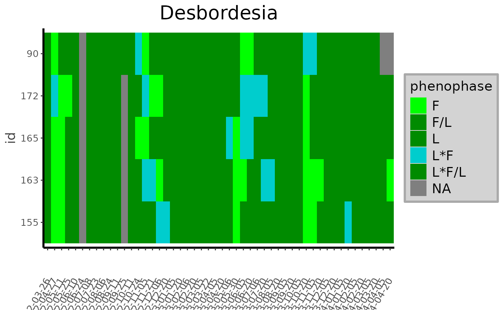
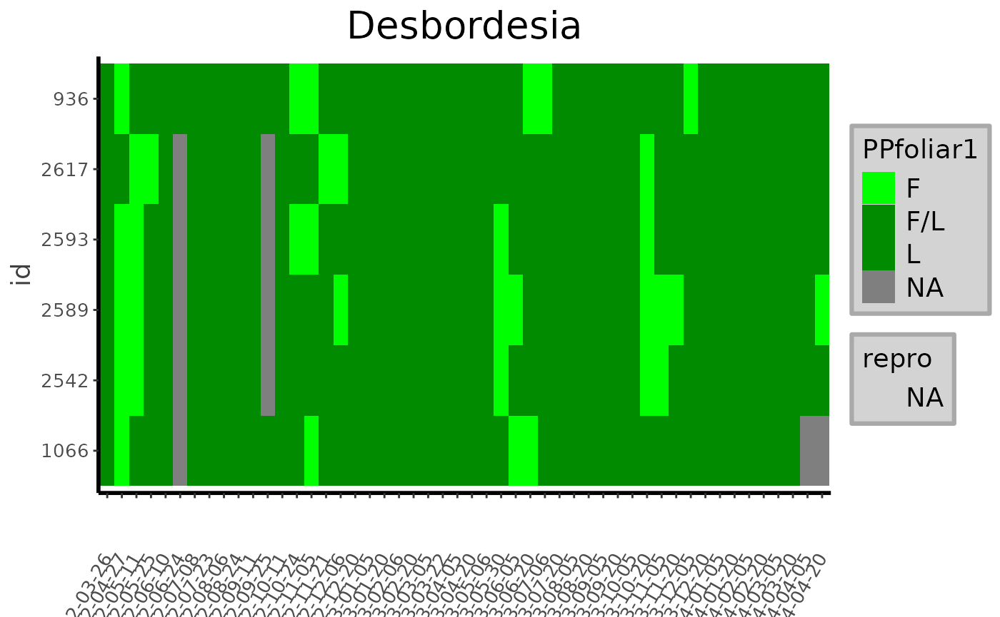
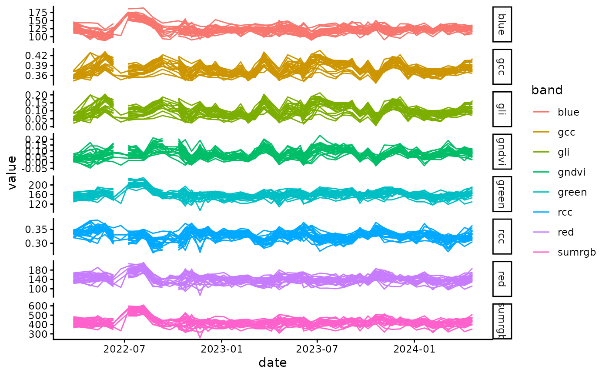
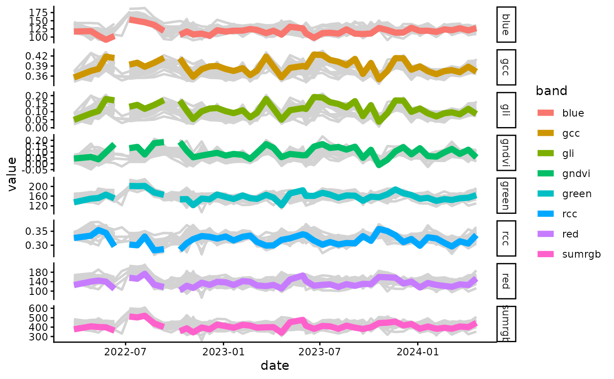
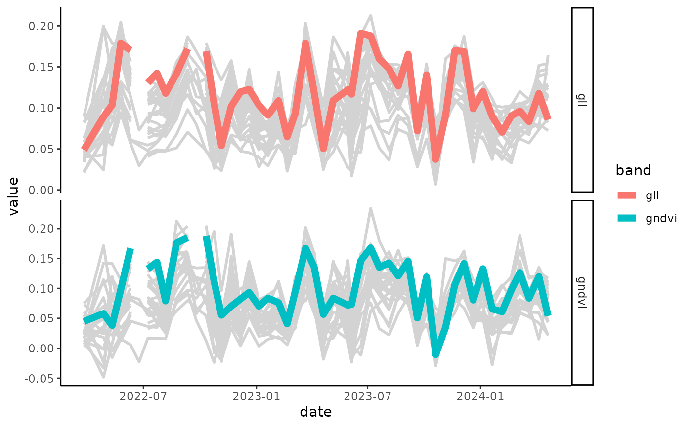
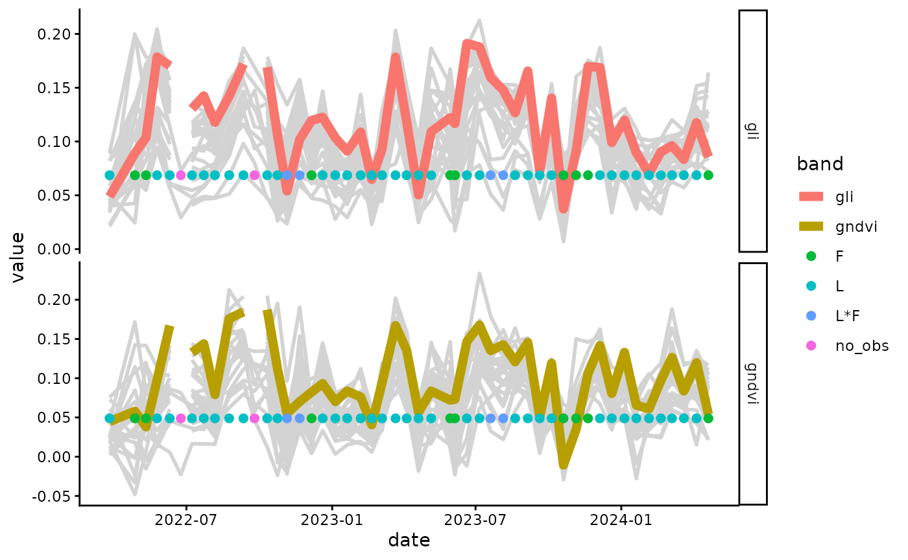

# workflow


``` r
library(canObsR)
#> Warning: replacing previous import 'foreach::when' by 'purrr::when' when
#> loading 'canObsR'
#> Warning: replacing previous import 'foreach::accumulate' by 'purrr::accumulate'
#> when loading 'canObsR'
#> Warning: replacing previous import 'colourpicker::runExample' by
#> 'shiny::runExample' when loading 'canObsR'
#> Warning: replacing previous import 'DT::dataTableOutput' by
#> 'shiny::dataTableOutput' when loading 'canObsR'
#> Warning: replacing previous import 'DT::renderDataTable' by
#> 'shiny::renderDataTable' when loading 'canObsR'
#> Warning: replacing previous import 'colourpicker::colourPicker' by
#> 'shinyjs::colourPicker' when loading 'canObsR'
#> Warning: replacing previous import 'shinyWidgets::alert' by 'shinyjs::alert'
#> when loading 'canObsR'
#> Warning: replacing previous import 'colourpicker::updateColourInput' by
#> 'shinyjs::updateColourInput' when loading 'canObsR'
#> Warning: replacing previous import 'future::reset' by 'shinyjs::reset' when
#> loading 'canObsR'
#> Warning: replacing previous import 'shiny::runExample' by 'shinyjs::runExample'
#> when loading 'canObsR'
#> Warning: replacing previous import 'colourpicker::colourInput' by
#> 'shinyjs::colourInput' when loading 'canObsR'
#> Warning: replacing previous import 'shinyjs::click' by 'terra::click' when
#> loading 'canObsR'
#> Warning: replacing previous import 'dplyr::intersect' by 'terra::intersect'
#> when loading 'canObsR'
#> Warning: replacing previous import 'shinyWidgets::panel' by 'terra::panel' when
#> loading 'canObsR'
#> Warning: replacing previous import 'dplyr::union' by 'terra::union' when
#> loading 'canObsR'
#> Warning: replacing previous import 'terra::extract' by 'tidyr::extract' when
#> loading 'canObsR'
#> Warning: replacing previous import 'terra::quantile' by 'stats::quantile' when
#> loading 'canObsR'
library(tidyr)
library(dplyr)
#> 
#> Attaching package: 'dplyr'
#> The following objects are masked from 'package:stats':
#> 
#>     filter, lag
#> The following objects are masked from 'package:base':
#> 
#>     intersect, setdiff, setequal, union
library(stringr)

data("data_labeling")
data("rgb_data")

data_labeling_simplify <- data_labeling %>% dplyr::mutate(phenophase = dplyr::case_when(phenophase == 
                                                                            "NA" ~ "no_obs", stringr::str_detect(phenophase, "Fr") ~ stringr::str_replace(phenophase, "Fr", "fr"), stringr::str_detect(phenophase, "Fl") ~ stringr::str_replace(phenophase, "Fl", "fl"), phenophase == "?" ~ NA, stringr::str_detect(phenophase, ",") ~ stringr::str_replace(phenophase, ",", "/"), stringr::str_detect(phenophase, "\\;$") ~
                                                                            stringr::str_sub(phenophase, 1, nchar(phenophase) -
                                                                                                1), TRUE ~ phenophase)) %>% dplyr::mutate(phenophase1 = phenophase) %>%
   tidyr::separate(phenophase1, c("PPfoliar", "PPrepro"), ";", fill = "right") %>% tidyr::separate(PPfoliar, c("PPfoliar1", "PPfoliar2"), "\\*", fill = "right") %>%
   dplyr::mutate(
      PPfoliar2 = dplyr::case_when(!is.na(PPfoliar1) &
                                      is.na(PPfoliar2) ~ "no_obs", TRUE ~ PPfoliar2),
      PPFlo = dplyr::case_when(
         is.na(PPfoliar1) ~
            NA,
         stringr::str_detect(PPrepro, "fl") ~ 1,
         TRUE ~ 0
      ),
      PPFr = dplyr::case_when(
         is.na(PPfoliar1) ~
            NA,
         stringr::str_detect(PPrepro, "fr") ~ 1,
         TRUE ~ 0
      ),
      PPFlo_uncertainty = dplyr::case_when(
         is.na(PPfoliar1) ~
            NA,
         stringr::str_detect(PPrepro, "\\?") &
            PPFlo == 1 ~ 1,
         TRUE ~ 0
      ),
      PPFr_uncertainty = dplyr::case_when(
         is.na(PPfoliar1) ~
            NA,
         stringr::str_detect(PPrepro, "\\?") &
            PPFr == 1 ~ 1,
         TRUE ~ 0
      ),
      desynchr = dplyr::case_when(
         is.na(PPfoliar1) ~
            NA,
         !is.na(PPfoliar2) & PPfoliar2 != "no_obs" ~
            1,
         TRUE ~ 0
      ),
      PPfoliar1_uncertainty = dplyr::case_when(
         is.na(PPfoliar1) ~
            NA,
         stringr::str_detect(PPfoliar1, "\\?") ~
            1,
         TRUE ~ 0
      ),
      PPfoliar2_uncertainty = dplyr::case_when(
         is.na(PPfoliar2) ~
            NA,
         stringr::str_detect(PPfoliar2, "\\?") ~
            1,
         TRUE ~ 0
      )
   ) %>% dplyr::select(-PPrepro) %>%
   dplyr::select(
      site:phenophase,
      PPfoliar1,
      PPfoliar2,
      PPFlo:PPfoliar2_uncertainty,
      obs,
      comments,
      update,
      Usable_crown
   )

heatmap_Labels(data_labeling,
               Specie = NULL,
               Genus = 'Desbordesia',
               Family = NULL,
               title = NULL)
#> Warning: No shared levels found between `names(values)` of the manual scale and the
#> data's colour values.
#> Warning: No shared levels found between `names(values)` of the manual scale and the
#> data's shape values.
```



``` r

heatmap_Labels(data_labeling_simplify,
               Specie = NULL,
               Genus = 'Desbordesia',
               Family = NULL,
               title = NULL,
               simplify = TRUE)
#> Warning: Removed 250 rows containing missing values or values outside the scale range
#> (`geom_point()`).
```



``` r

merge_data <- merge_values(data_labeling, rgb_data)
```

``` r
plot_signal(data = merge_data, Genus = 'Desbordesia')
```



``` r
plot_signal(data = merge_data, Genus = 'Desbordesia', slcted_id = 163)
#> Warning: Using `size` aesthetic for lines was deprecated in ggplot2 3.4.0.
#> ℹ Please use `linewidth` instead.
#> ℹ The deprecated feature was likely used in the canObsR package.
#>   Please report the issue at <https://github.com/umr-amap/canObsR/issues>.
#> This warning is displayed once per session.
#> Call `lifecycle::last_lifecycle_warnings()` to see where this warning was
#> generated.
```



``` r
plot_signal(data = merge_data, Genus = 'Desbordesia', slcted_id = 163, Band = c('gndvi','gli'))
```



``` r
plot_signal(data = merge_data, Genus = 'Desbordesia', slcted_id = 163, Band = c('gndvi','gli'), show_Labels = TRUE)
#> Warning in geom_point(data = dplyr::filter(data, highlight ==
#> paste(slcted_id)), : Ignoring unknown parameters: `fontface`
```


