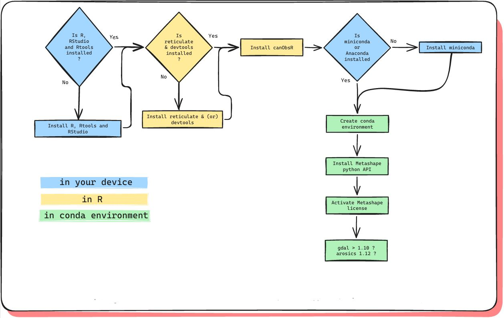

```{r, include = FALSE}
knitr::opts_chunk$set(
  collapse = TRUE,
  comment = "#>"
)
```


<div style="padding:10px; background-color:#f0f8ff; border-left:5px solid #4682b4; font-size: 1.1em;">
📺 Pour plus d'informations sur l'installation, consultez la vidéo :  
<a href="https://www.youtube.com/@canObsR" target="_blank">https://www.youtube.com/@canObsR</a>
</div>

---


# Why the installation process is more complex

The installation of canObsR involves several steps that go beyond a typical R package. This is because the package acts as a bridge between different tools used for processing imagery. 

**Python integration**: Some key processing steps rely on specialized Python libraries. To make this work seamlessly from R, we use the reticulate package, which requires setting up a Python environment via Miniconda. This allows us to run Python scripts directly from R functions.

**Environment setup**: We provide a .yml file to create a dedicated Python environment with all the required dependencies. This ensures that the Python code used in the package runs reliably, regardless of the user's system.

**Metashape integration**: Some image processing steps rely on Agisoft Metashape, a commercial software. To use these features, Metashape must be installed, and a valid license key must be activated.

Although the setup may seem complex at first, it ensures that once installed, all components work together smoothly.

```{r echo=FALSE, fig.show='hold',fig.align="center", message=FALSE, fig.cap="Fig 1 : Installation proccess", warning=FALSE, out.width='100%'}

```

# 📥 Install R, Rtools et RStudio

### 🔹 R : Download and install the last version of R on the [CRAN R](https://cran.r-project.org/)

### 🔹 Rtools : Download and install [CRAN Rtools](https://cran.r-project.org/bin/windows/Rtools/)

### 🔹 RStudio : Download and install  [RStudio Desktop](https://posit.co/download/rstudio-desktop/)

---

# 📦 Install devtools and reticulate 
*In RStudio console*
```{r, eval=F, echo=T}
install.packages("devtools")
install.packages("reticulate")

library(devtools)
install_github("https://github.com/umr-amap/canObsR.git")
```

---


# 📦 Install canObsR 
*In RStudio console*
```{r, eval=F, echo=T}
library(devtools)
install_github("https://github.com/umr-amap/canObsR.git")
```

---

# ⚙️ Install Miniconda
*In RStudio console*
```{r, eval=F, echo=T}
library(reticulate)
reticulate::install_miniconda()
library(reticulate)
use_condaenv("r-reticulate", required = TRUE)
```

---

# 🏗 Create and configurate the conda environment 
*In RStudio console*
```{r, eval=F, echo=T}
library(canObsR)

YAML_file <- system.file("PYTHON/environment.yaml", package = "canObsR")
envname <- "canObsR-env"
conda_exe <- detect_conda(auto_select = FALSE)
system2(conda_exe, args = c("env", "create", "-n", envname, "--file", shQuote(YAML_file)))
```

---

# 🏗 Install de Metashape

The environment you just created contains already all necessary dependences but the Metashape python API, which is required to align photos using TimeSIFT.

🔻 Download the .whl file here : 
https://www.agisoft.com/downloads/installer/

Go to the "Python 3 module" section and click on the link corresponding to your operating system. This should download a file named "Metashape[...].whl". Then, copy the path to the downloaded .whl file below<br><br>
*In RStudio console*
```{r, eval=F, echo=T}
whl_file <- ".../Metashape-2.2.1-cp37.cp38.cp39.cp310.cp311-none-win_amd64.whl"

use_condaenv(envname, required = TRUE)
if (file.exists(whl_file)) {
  message("Installation of Metashape from the .whl file…")
  py_install(
    packages = whl_file,
    pip = TRUE
  )
} else {
  warning("❌️ File .whl not found : ", whl_file)
}

py_module_available("Metashape") # Should be TRUE
```

---

# 🔑 Metashape license activation

Your python environment should be ready for use now. However, Agisoft Metashape requires a paid license in order to access all its features.
It is not necessary to have the Metashape application installed on your device in order for the python API to work, but whether or not the application is installed and/or activated, the API still needs to be activated using a license key (it can be the same used for the application if it is already installed).


To activate the key, follow these steps :

- Open an anaconda command prompt
- Activate the environnement "canObsR-env", and start python :<br><br>

*In Anaconda prompt*
```{bash, eval=FALSE}
conda activate canObs-env
python
```
Now you can activate the licence (replace with your license key):<br><br>

*In Anaconda prompt*
```{bash, eval=FALSE}
import Metashape
Metashape.license.activate("AAAA-BBBB-CCCC-DDDD")
exit()
```
If that works, you can close the command prompt. 

---

# 🆚 Check the version of arosics and gdal

The version should be : arosics=1.12 and gdal=3.10. If you have older versions, upgrade them.<br><br>

*In RStudio console*
```{r, eval=F, echo=T}
library(dplyr)

reticulate::py_list_packages() %>% 
  filter(package %in% c('arosics', 'gdal'))
```

## If you need to ugrade arosics : 

- Open an anaconda command prompt
- Activate the environnement "canObsR-env", and upgrade :
<br><br>

*In Anaconda prompt*
```{bash, eval=FALSE}
conda activate canObs-env
pip install arosics --upgrade
```

## If you need to ugrade gdal : 

🔻 Windows : Download GDAL-3.10.1-cp311-cp311-win_amd64.whl
🔻 Mac : Download gdal-3.10.1-cp311-cp311-macosx_13_0_x86_64.whl
🔻 Linux : Downloadgdal-3.10.1-cp311-cp311-manylinux2014_x86_64.manylinux_2_17_x86_64.whl
<br><br>

- Open an anaconda command prompt
- Activate the environnement "canObsR-env"
- Install gdal from the GDAL-3.10.1 whl file
<br><br>

*In Anaconda prompt*
```{bash, eval=FALSE}
conda activate canObs-env
pip install your-path-to-gdal.whl
```
<br><br>

You should be good to go now ! 🎉
<br><br>


# 🔁 Restart R 

*In RStudio console*
```{r, eval=F, echo=T}
library(reticulate)
library(canObsR)

envname <- "canObsR-env"
use_condaenv(envname, required = TRUE)
```

