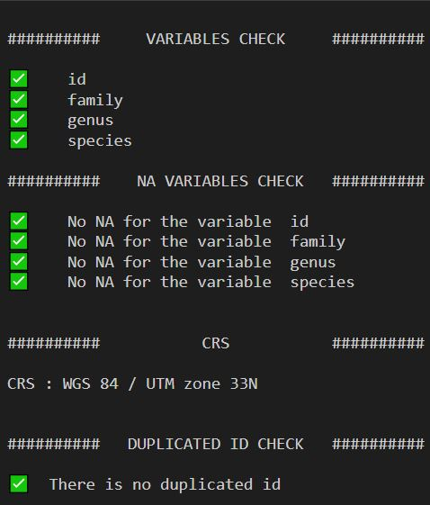
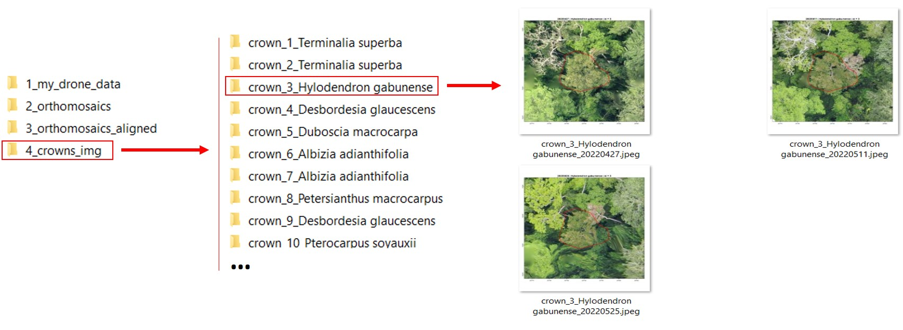
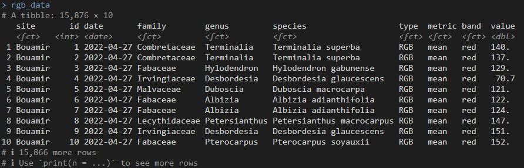
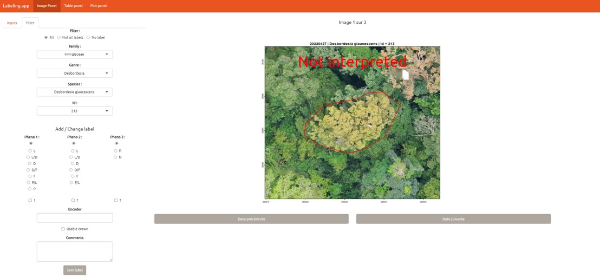

```{r, include = FALSE}
knitr::opts_chunk$set(
  collapse = TRUE,
  comment = "#>"
)
```

Here is an aticle to guide you step by step through the extraction of crowns scale data. All you need to start it is a **RGB orthomosaics time serie** and a **shapefile of the crowns delineations**. To run the following code you have to download the test data (link is coming).

```{r, eval=F, echo=T}
############## Load libraries --------------------------------------------------

library(canObsR)
library(tidyverse)
library(sf)
library(openxlsx)
```

---

# Set parameters

Set the **path** to the CanObsR_data folder, the **site** name, the **Tmpfiles_directory** if you want to store the temporary files in a specific folder and **N_cores** the number of cores you want to allocate for the parallelized functions*.

Note* : The functions `extract_crownsImages()` and `extract_rgbValues()` can produce a 
lot of temporary files and need several GB of memory depending on the size, the 
resolution and the number of mosaics. You can specify where you want to store 
the temporary files.

```{r, eval=F, echo=T}
############## Set parameters --------------------------------------------------

# Path to the main directory
path = 'XXXX/canObsR_data'

# Site
site = 'Bouamir'

# Path to store the temp files
Tmpfiles_directory = 'XXX/R_tmpdir' # NULL if you want to use the default folder

# Number of cores used for the paralelized functions
N_cores = 10
```

If you are using the test data just 
run the following code to get the path to the RGB mosaics (**imgs**) and the 
dates of the images (**dates**).

```{r, eval=F, echo=T}
# Path to the mosaics
imgs <- list.files(file.path(path,'3_orthomosaics_aligned'), full.names = T)

# Extract the dates of the images
dates <- 
   extr_dates(names_img = basename(imgs), n = 2, sep = '', extension = '.tif')
```

---

# First step : Test the crowns shapefile compatible

The first step is to check the crowns file compatibility with the function 
`check_crownsFile`. To be compatible with the package functions the shapefile 
must have :  

* at least the variables 'id', 'species', 'genus' and 'family'
* 'species', 'genus' and 'family' should not have NA. Replace them by 'indet'
* 'id' should not have duplicated values.

```{r, eval=F, echo=T}
############## STEP 1 Check and modify the crowns file  ------------------------

# Check the crowns file compatibility

check_crownsFile(
   path_crowns = file.path(path,'crowns.gpkg')
   ) # Output : Image 1 (1)

#------------------------------------------------------------------------------#
#------------------------------------------------------------------------------#

# Rename variables

sf::read_sf(file.path(path,'crowns.gpkg')) %>%  # Load the file
   
   rename(
      family = tax_fam,          # Rename the corresponding variable as 'family'
      genus = tax_gen,            # Rename the corresponding variable as 'genus'
      species = tx_sp_lvl       # Rename the corresponding variable as 'species'
   ) %>%
   
   sf::write_sf(.,file.path(path,'crowns_corrected.gpkg')) # And save the file

# Check the new crowns file compatibility

check_crownsFile(
   path_crowns = file.path(path,'crowns_corrected.gpkg')
   ) # Output : Image 1 (2)

#------------------------------------------------------------------------------#
#------------------------------------------------------------------------------#

# Rename NA to 'indet'

sf::read_sf(file.path(path,'crowns_corrected.gpkg')) %>%     # Load the new file
   
   mutate(
      # Rename NA to 'indet' in the family variable
      family = case_when(is.na(family)~ 'indet', TRUE ~ family),
      
      # Same for genus
      genus = case_when(is.na(genus)~ 'indet', TRUE ~ genus),
      
      # Same for species
      species = case_when(is.na(species)~ paste(genus, 'indet'), TRUE ~ species)
      ) %>%
   
   sf::write_sf(.,file.path(path,'crowns_corrected.gpkg')) # And save the file

# Re-check the new crowns file compatibility

check_crownsFile(
   path_crowns = file.path(path,'crowns_corrected.gpkg')
   ) # Output : Image 1 (3)

```


```{r echo=FALSE, fig.show='hold',fig.align="center", message=FALSE, fig.cap="check_crownsFile outputs", warning=FALSE, out.width='100%'}

```

---

# Second step : Extract crowns images per date

The second step is to extract individual crown images per date with the function
`extract_crownsImages`. The function can be used in parallelization when N_cores
is superior at 1 and can use a lot of memory (several GB). It is better to specify 
where to store the temporary files to be sur to have enought space. If you use the 
test data, it can take about 15 minutes (or more).

```{r, eval=F, echo=T}
############## STEP 2 Extract crowns images ------------------------------------

extract_crownsImages(
   path_images = imgs,                                         # Path to mosaics
   path_crowns = file.path(path,'crowns_corrected.gpkg'), # Path to  crowns file
   out_dir_path =  file.path(path,'4_crowns_img'),       # Path to output folder
   tempdir_custom = Tmpfiles_directory,             # Path to tmp file directory
   site = NULL,                  # If NULL, will be extract from the path_images
   dates = NULL,                 # If NULL, will be extract from the path_images
   N_cores = N_cores,                                          # Number of cores 
   width = 720,                                           # By default it is 720 
   height = 825                                           # By default it is 720 
)
```


```{r echo=FALSE, fig.show='hold',fig.align="center", fig.cap="extract_crownsImages outputs files", message=FALSE, warning=FALSE, out.width='100%'}

```

---

# Third step : Extract crowns images per date

```{r, eval=F, echo=T}
############## STEP 3 Extract spectral indices from mosaics at the crown scale -

rgb_data <- extract_rgbValues (
   path_images = imgs,                                         # Path to mosaics
   path_crowns = file.path(path,'crowns_corrected.gpkg'), # Path to  crowns file
   out_dir_path =  path,                                 # Path to output folder
   tempdir_custom = Tmpfiles_directory,             # Path to tmp file directory
   ncor = N_cores,                                             # Number of cores 
   sites = NULL,                 # If NULL, will be extract from the path_images
   dates = NULL,                 # If NULL, will be extract from the path_images
   file_type = '.xlsx'                   # Could be '.csv' or '.xlsx' or 'RData'
)

```


```{r echo=FALSE, fig.show='hold',fig.align="center", fig.cap="extract_rgbValues outputs files", message=FALSE, warning=FALSE, out.width='100%'}

```

---

# Fouth step : Create the labeling file and label images

`create_labelingFile` will create a xlsx file that can directly be used by a shiny
application (`shiny_labels`) to do the labeling.

```{r, eval=F, echo=T}
############## STEP 4 Create file to do the labeling  --------------------------

create_labelingFile(
   path_crowns = file.path(path,'crowns_corrected.gpkg'), # Path to  crowns file
   site = site,                                                      # Site name
   dates = dates,                                      # Dates of the RGB survey
   out_dir_path = path)                                  # Path to output folder


# open it
openXL(file.path(path,paste(site,'labelingFile',paste0(format(as.Date(Sys.Date(),format="%Y-%m-%d"), format = "%Y%m%d"), '.xlsx'), sep = '_' )))
```

---

```{r, eval=F, echo=T}      

############## STEP 5 Fill the labelingFile with shiny app  --------------------
        
# Import the labelingFile
labeling_file <- file.path(
   path,
   paste('Bouamir_labelingFile',
         paste0(
            format(as.Date(Sys.Date(),format="%Y-%m-%d"), format ="%Y%m%d"),
            '.xlsx'), 
         sep = '_' )
      )

# Start the app

shiny_labels(
   data_labeling = labeling_file,
   newFile = file.path(path,paste(site,'labelingFile_update.xlsx')),
   imgFolder = file.path(path,'4_crowns_img') # Path to the crowns images folder
   ) 
```


```{r echo=FALSE, fig.show='hold',fig.align="center", fig.cap="shiny_visualisation", message=FALSE, warning=FALSE, out.width='100%'}

```
