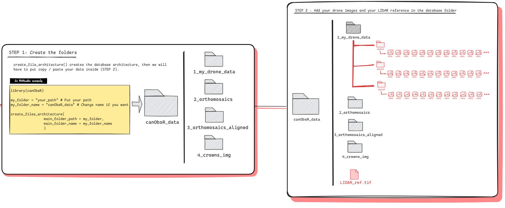

```{r, include = FALSE}
knitr::opts_chunk$set(
  collapse = TRUE,
  comment = "#>"
)
```

---

# Summary 

The files architecture described below must be adopted to avoid any issue when using canObsR, especially for the functions generate_Mosa() and align_Mosa(). The create_files_architecture() functions generate the folders (Fig.1, step 1) and then you should manually add your drone images into the folder '1_my_drone_data' and the lidar reference directly to the root folder (Fig. 1, step 2).  


```{r echo=FALSE, fig.show='hold',fig.align="center", message=FALSE, fig.cap="Fig 1 : Prepare database", warning=FALSE, out.width='100%'}

```

---

# Structure of '1_my_drone_data'

The structure of the data in '1_my_drone_data' should be in one of the following ways : 

- place one folder by date in '1_my_drone_data', each consisting of subdirectories for each flight (Fig.2, left)
- place one folder by flight in '1_my_drone_data' (Fig.2, center)
- place one folder by date in '1_my_drone_data', and add all the images concerned by the date directly in the folder (Fig.2, left)

In both cases, the date must be indicated in the name of the folders directly containing images, in the YYYYMMDD or YYYYMM formats.   


```{r echo=FALSE, fig.show='hold',fig.align="center", message=FALSE, fig.cap="Fig 2 : Structure of the drone data", warning=FALSE, out.width='100%'}
knitr::include_graphics("img/drone_data.JPG")
```
