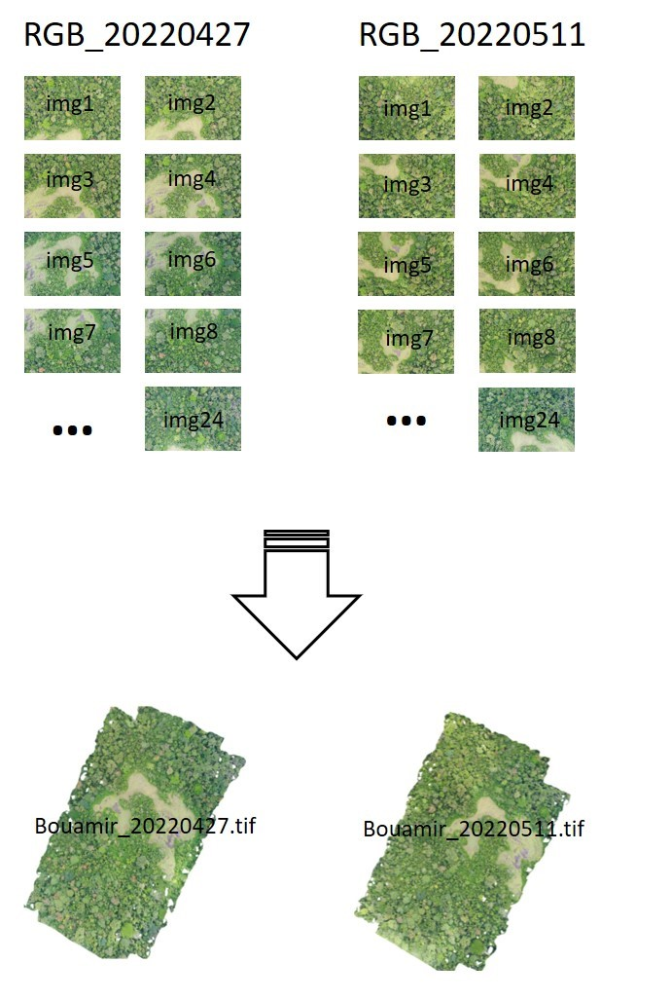

```{r, include = FALSE}
knitr::opts_chunk$set(
  collapse = TRUE,
  comment = "#>"
)
```


Here is a short example to guide you step by step through the orthomosaic generating process with the functions [`generate_Mosa()`](https://hugolblc.github.io/managecrownsdata/reference/generate_Mosa.html) and [`generate_Mosa()`](https://hugolblc.github.io/managecrownsdata/reference/generate_Mosa.html). These functions required, arosics(AROSICS), the Metashape python API and a valid Metashape license.  

* First you will need to download the  [test data](https://filesender.renater.fr/?s=download&token=e67ac550-0546-4204-9a5a-24989cc0aff3) and unzip it. Test
data contains, 2 sets of drones images from the same area obtained from 2 differents dates and a **DTM** digital terrain model from the the area which is the reference. 

* Then run the following code, more details about the functions  [`generate_Mosa()`](https://hugolblc.github.io/managecrownsdata/reference/generate_Mosa.html) and [`generate_Mosa()`](https://hugolblc.github.io/managecrownsdata/reference/generate_Mosa.html) here.


```{r, eval=F, echo=T}
library(managecrownsdata)
library(reticulate)

use_condaenv('managecrownsdata_env')

my_path <- 'XXXX/test_data'

generate_Mosa(path_in = file.path(directory, 'my_drone_data'),
          out_dir_ortho = file.path(directory, 'outputs_arosics'),
          data_type = "RGB",
          resol_ref = 0.5,
          site_name = "Bouamir",
          crs = "EPSG::32633",
) # Export Time_SFIFT outputs into 'outputs_arosics' folder

generate_Mosa(path_in = file.path(directory, 'outputs_arosics'),
        ref_filepath = file.path(directory, 'Bouamir_LiDAR_mars2022_ref_red.tif'),
        out_dir_path = file.path(directory, 'outputs_TS'),
        corr_type = "global",
        #grid_res = 200,
        window_size = 500,
        window_pos = list(258131, 352973),
        save_data = FALSE
) # Export arosics outputs into 'outputs_TS' folder

```

```{r echo=FALSE, fig.show='hold',fig.align="center",fig.cap="Generate orthomosaics", message=FALSE, warning=FALSE, out.width='100%'}

```
