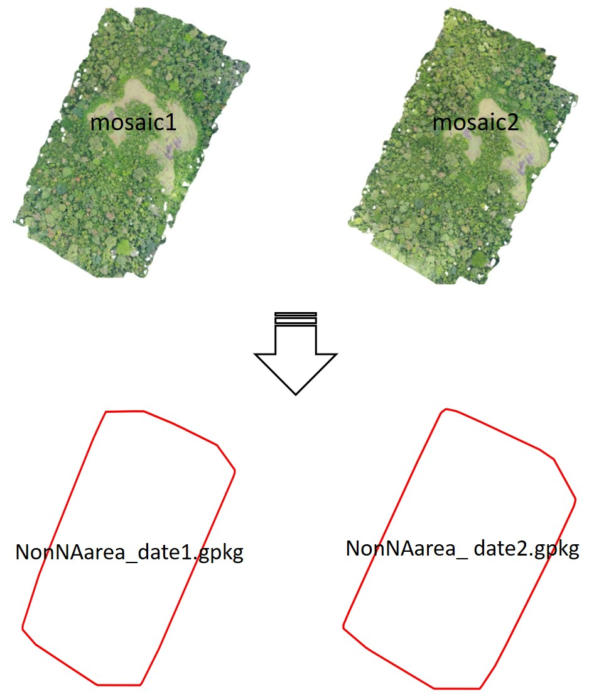
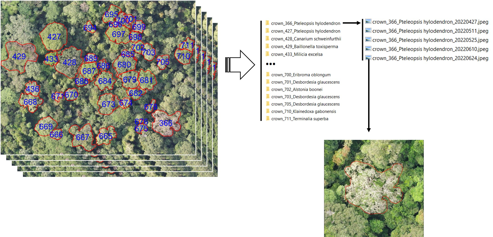
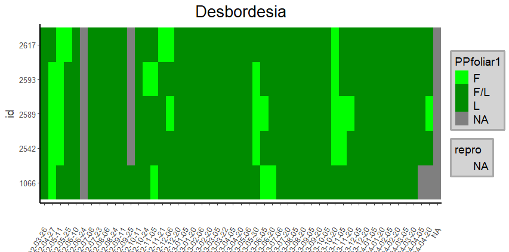
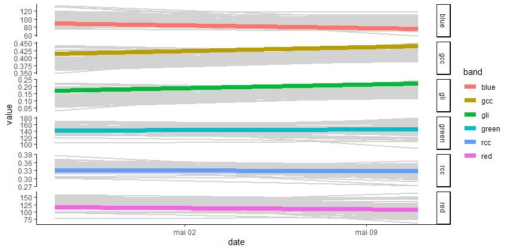
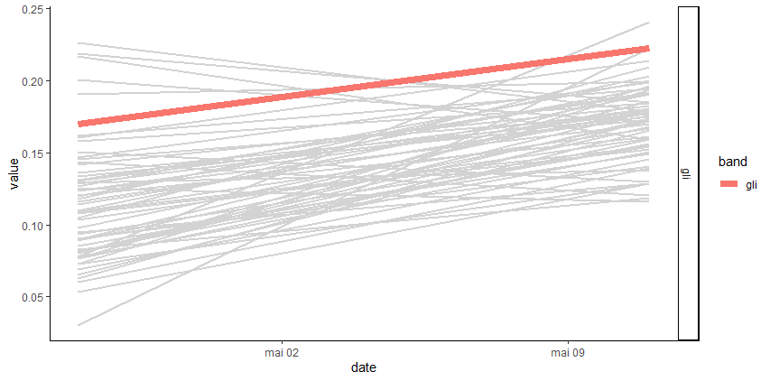

```{r, include = FALSE}
knitr::opts_chunk$set(
  collapse = TRUE,
  comment = "#>"
)
```

```{r, eval=F, echo=T}
library(canObsR)
library(tidyverse)

my_path <- 'XXXX/UAV_observatory_data_tuto1'

bbox <- create_nonNA_bboxImages(
  path_in = file.path(my_path, "5_arosics_output"),
  out_dir_path = file.path(my_path, "6_bbox")
)
```

```{r echo=FALSE, fig.show='hold',fig.align="center", message=FALSE, warning=FALSE, out.width='100%'}

```

```{r, eval=F, echo=T}
check_crownsFile(path_crowns = file.path(my_path, "3_crowns/crowns_2024_11_04.gpkg"))

sf::read_sf(path_crowns) %>%
   rename(
      geometry = geom,
      family = tax_fam,
      genus = tax_gen,
      species = tx_sp_lvl,
      code_sp = idtax_f
   ) %>%
   sf::write_sf(.,file.path(my_path, "3_crowns/crowns_2024_11_04_rename.gpkg"))


extract_crownsImages(
  path_in = file.path(my_path, "5_arosics_output"),
  path_crowns = file.path(my_path, "3_crowns/crowns_2024_11_04_rename.gpkg"),
  path_bbox = file.path(my_path, "6_bbox"),
  out_dir_path = file.path(my_path, "7_crownsImages"),
  site = NULL,
  dates = NULL,
  N_cores = 1,
  width = 720,
  height = 825
)
```

```{r echo=FALSE, fig.show='hold',fig.align="center", message=FALSE, warning=FALSE, out.width='100%'}

```

```{r, eval=F, echo=T}
rgb_data <- extract_rgbValues (
      path_in = file.path(directory, "5_arosics_output"),
      path_crowns = file.path(directory, "3_crowns/crowns_2024_11_04_rename.gpkg"),
      out_dir_path = file.path(directory, "9_outputs/"),
      ncor = 1,
      sites = NULL,
      dates = NULL
   )
```

```{r echo=FALSE, fig.show='hold',fig.align="center", message=FALSE, warning=FALSE, out.width='100%'}
knitr::include_graphics("img/rgb_values.JPG")
```

```{r, eval=F, echo=T}
pivotLabels <- pivot_Labels(labels_path = file.path(directory, "8_labeling_file/Bouamir_labelingFile.xlsx"),
             out_dir_path = file.path(directory, "9_outputs"),
             simplify_labels = TRUE)


heatmap_Labels(pivotLabels,
               Specie = NULL,
               Genus = 'Desbordesia',
               Family = NULL,
               title = NULL)
```

```{r echo=FALSE, fig.show='hold',fig.align="center", message=FALSE, warning=FALSE, out.width='100%'}
knitr::include_graphics("img/phenologramme1.png")
```

```{r, eval=F, echo=T}
heatmap_Labels(pivotLabels,
               Specie = NULL,
               Genus = 'Desbordesia',
               Family = NULL,
               title = NULL,
               simplify = TRUE)
```

```{r echo=FALSE, fig.show='hold',fig.align="center", message=FALSE, warning=FALSE, out.width='100%'}

```

```{r, eval=F, echo=T}
merge_data <- merge_values(pivotLabels, rgb_data)

plot_signal(data = merge_data, Genus = 'Desbordesia')
```

```{r echo=FALSE, fig.show='hold',fig.align="center", message=FALSE, warning=FALSE, out.width='100%'}
knitr::include_graphics("img/signal1.png")
```


```{r, eval=F, echo=T}
plot_signal(data = merge_data, Genus = 'Desbordesia', slcted_id = 2614)

```

```{r echo=FALSE, fig.show='hold',fig.align="center", message=FALSE, warning=FALSE, out.width='100%'}

```

```{r, eval=F, echo=T}
plot_signal(data = merge_data, Genus = 'Desbordesia', slcted_id = 2614, Band = c('gli', 'gndvi'))

```

```{r echo=FALSE, fig.show='hold',fig.align="center", message=FALSE, warning=FALSE, out.width='100%'}

```
